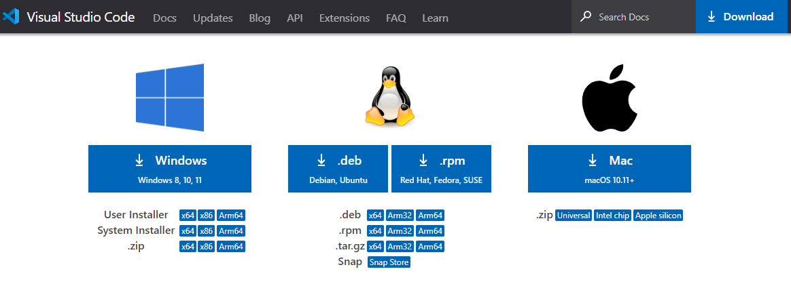

# Contributing to the Toolkit

The following information provides a set of guidelines. We politely ask you to please use your best judgment, and, if you see room for improvement, please propose changes to this document!

- [Contributing to the Toolkit](#contributing-to-the-toolkit)
  - [What to contribute](#what-to-contribute)
  - [Just want to ask a question?](#just-want-to-ask-a-question)
  - [Setting up for development](#setting-up-for-development)
    - [Node.js](#nodejs)
    - [Yarn Package Manager](#yarn-package-manager)
    - [VS Code](#vs-code)
    - [Recommended Setup](#recommended-setup)
  - [What to work on](#what-to-work-on)
    - [Propose changes](#propose-changes)

## What to contribute

Contributions come in many forms, some examples include:

- Writing Documentation
- Raising Issues
- Developing new tools to add to the kit
- Any other actions that help develop the toolkit

## Just want to ask a question?

Please don't submit a pull request to ask a question. Instead, join us in the following communities, and ask all your questions.

- [Osmosis Toolkit/Companion Telegram][toolkit_tele]
- [Official Osmosis Telegram][osmo_tele]
- [Official Osmosis Community Discord][osmo_discord]

## Setting up for development

> Know what to expect? Skip to the recommended plugins and settings [here](#recommended-setup)

If you are unfamiliar with setting up an IDE, package managers, or working in a command line, we will take you through the basics here. If that all sounds scary? We recommend simply testing/using the toolkit and submitting issues. **Please note:** This guide is ever evolving and a work in progress. We graciously ask for suggestions from users that have followed this guide.

### Node.js

<!-- TODO: Node instructions -->

### Yarn Package Manager

<!-- TODO: Yarn instructions -->

### VS Code

The recommended IDE editor is Microsoft's [Visual Studio Code][vscode_link] (VS Code). This editor is available for ARM and AMD64 processors on Windows, Linux, and macOS.

### Recommended Setup

This repository has a `.vscode` folder included. This holds two files:

- `extensions.json`
- `settings.json`

These files will recommend the following plugins for VS Code and set settings for the workspace. These extensions and settings are subject to change regularly so please be sure to keep your local repository in sync with the latest version of the toolkit! It is also important to note that the `extensions.json` file also includes extensions we would like disabled or not installed.

<!-- markdownlint-disable MD033 -->

|  Type  |                     Name                     |                                Required/Recommended/Disable                                 |
| :----: | :------------------------------------------: | :-----------------------------------------------------------------------------------------: |
|  IDE   |            [VS Code][vscode_link]            |                       **REQUIRED**
                        |
| Plugin |           [ESLint][eslint_plugin]            |                       **REQUIRED**
                        |
| Plugin | [Prettier - Code formatter][prettier_plugin] |                       **REQUIRED**
                        |
| Plugin |  [EditorConfig for VS Code][editor_config]   |                       **REQUIRED**
                        |
| Plugin |  [Vue Language Features (Volar)][vue_volar]  |                       **REQUIRED**
                        |
| Plugin |        [TODO Highlight][todo_plugin]         |                       **REQUIRED**
                        |
| Plugin |          [Gitmoji][gitmoji_plugin]           |                       *Recommended*
                       |
| Plugin |  [Markdown All in One][markdownaio_plugin]   | *Recommended*
  If working with documentations files. |
| Plugin |            [Vetur][vetur_plugin]             |                         **DISABLE**
                         |
| Plugin |           [jshint][jshint_plugin]            |                         **DISABLE**
                         |

## What to work on

The first step is to find an issue you want to fix. To identify issues we think are good for first-time contributors, we add the **good first issue** label.

### Propose changes

We have enabled some protections such as:

- Requiring to submit pull requests (PR).

We like PRs because it allows the greater community to contribute, test, and give amazing feedback. Straightforward peer review is also a plus.

To contribute, we request that you follow the following workflow:

1. Clone the repository to your local machine.
2. [Fork the repository](https://github.com/osmo-support-lab/osmosis-toolkit)
3. Utilize our [`git flow` method](/src/pages/docs/git-flow.md) to create a new "feature", "bugfix", or "hotfix" branch locally.
4. Work on only one change in one pull request.
5. Follow these conventions:

    1. Generally, a commit serves a single purpose and differences should be easy to understand. Do not mix formatting fixes or code moves with actual code changes.
    2. Commit your changes. Write a simple, straightforward commit message. We recommend the [Gitmoji Plugin][gitmoji_plugin] for VS Code. Gitmoji allows an easy emoji selection for a quick visual reference to the type of commit you are pushing.
    3. Push changes to your personal remote fork *first*.
    4. Create a PR on the Osmosis Toolkit repository.
    5. Identify the type of PR by adding labels to it. For example, if you're still working on the changes, add the **work-in-progress** label. If you are proposing an enhancement, add the **enhancement** label.
    6. Wait for your changes to be reviewed. If you are a maintainer, you can assign your PR to one or more reviewers. If you aren't a maintainer, one of the maintainers will assign a reviewer.
    7. After you receive feedback from a reviewer, make the requested changes, commit them to your branch, and push them to your remote fork again.

After your PR is approved and validated, and no conflicts exist, it will be merged by a maintainer.

[toolkit_tele]: https://t.me/OsmosisCompanionChat
[osmo_tele]: https://t.me/osmosis_chat
[osmo_discord]: https://discord.gg/osmosis
[vscode_link]: https://code.visualstudio.com/
[eslint_plugin]: https://marketplace.visualstudio.com/items?itemName=dbaeumer.vscode-eslint
[prettier_plugin]: https://marketplace.visualstudio.com/items?itemName=esbenp.prettier-vscode
[editor_config]: https://marketplace.visualstudio.com/items?itemName=EditorConfig.EditorConfig
[vue_volar]: https://marketplace.visualstudio.com/items?itemName=Vue.volar
[todo_plugin]: https://marketplace.visualstudio.com/items?itemName=wayou.vscode-todo-highlight
[gitmoji_plugin]: https://marketplace.visualstudio.com/items?itemName=seatonjiang.gitmoji-vscode
[markdownaio_plugin]: https://marketplace.visualstudio.com/items?itemName=yzhang.markdown-all-in-one
[vetur_plugin]: https://marketplace.visualstudio.com/items?itemName=octref.vetur
[jshint_plugin]: https://marketplace.visualstudio.com/items?itemName=dbaeumer.jshint
